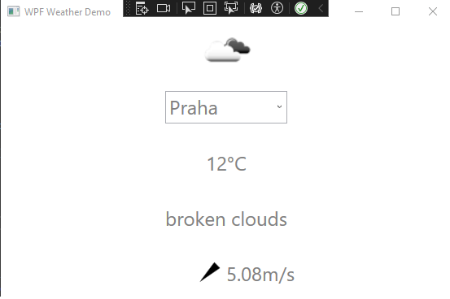

# GUI_WPF
# WPF Weather Demo

This is a simple WPF (Windows Presentation Foundation) application that demonstrates how to fetch and display weather information for selected cities. It uses XAML for the user interface and C# for the backend logic. This README provides an overview of the code and its components.

This is a simple WPF (Windows Presentation Foundation) application that demonstrates how to fetch and display weather information for selected cities. It uses XAML for the user interface and C# for the backend logic. This README provides an overview of the code and its components.

## Prerequisites

Before running the application, make sure you have the following prerequisites:

- Visual Studio (or any other compatible IDE for C# development)
- .NET Framework

## Project Structure

The project is structured as follows:

- **MainWindow.xaml:** This XAML file defines the main window and its UI elements. It also includes various styles for TextBlock, Label, and ComboBox elements.

- **WeatherViewModel.cs:** This C# class is the ViewModel for the application. It handles data retrieval and provides data binding for the UI. It communicates with the `IWeatherService` to fetch weather data.

## MainWindow.xaml

- The `Window` element is defined with various attributes such as title, dimensions, and data context for design purposes.

- Inside the `Window.Resources` section, styles are defined for different UI elements like `TextBlock`, `Label`, and `ComboBox`. These styles define properties such as font size and foreground color.

- The main UI layout is structured using a `Grid` with five rows. It includes elements like `Image`, `ComboBox`, `TextBlock`, `Label`, and a `Polygon` for displaying weather-related information.

- The `ComboBox` element includes behaviors that trigger the `DownloadWeatherCommand` when loaded and when the selection changes. It also includes a default list of cities.

## WeatherViewModel.cs

- This class implements the ViewModel for the application.

- It contains properties such as `DownloadingWeather`, `IsWeatherInvalid`, `ErrorMessage`, and `Weather` for data binding with the UI.

- The `DownloadWeatherCommand` is an `AsyncRelayCommand` that is invoked when the user selects a city. It calls the `UpdateWeatherAsync` method.

- The `UpdateWeatherAsync` method is responsible for fetching weather data. It sets the `DownloadingWeather` flag, handles exceptions, and updates the UI accordingly.

- The `HandleUpdateWeatherFailed` method is used to handle exceptions during weather data retrieval.

## Usage

1. Make sure you have the required prerequisites installed.

2. Open the project in Visual Studio or your preferred IDE.

3. Build and run the application.

4. Select a city from the ComboBox, and the weather information will be displayed in the UI.

## Contributing

If you want to contribute to this project, feel free to fork it and submit a pull request with your enhancements.

## License

This project is under the MIT License. See the [LICENSE](LICENSE) file for details.

---

This README provides an overview of the WPF Weather Demo project. It explains the structure, usage, and how to contribute to the project. Enjoy exploring and developing the application!
